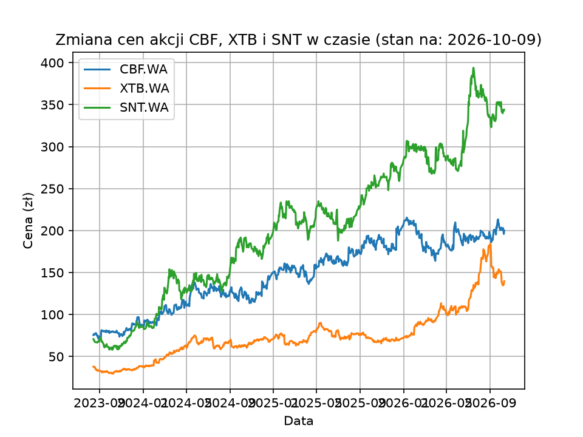
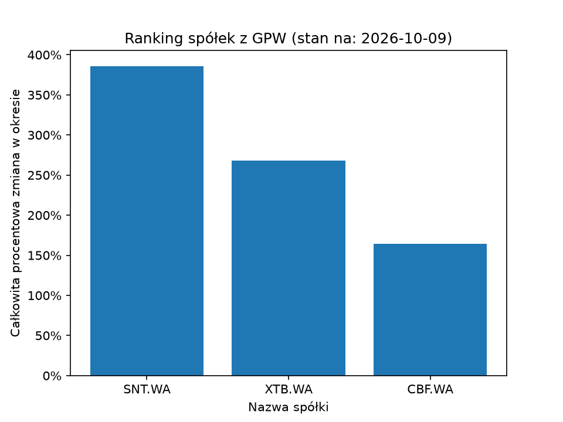
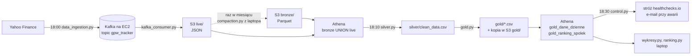

# GPW Pulse

Codzienny potok danych dla trzech spółek z Giełdy Papierów Wartościowych w Warszawie
(Cyber_Folks `CBF`, XTB `XTB`, Synektik `SNT`). Co wieczór o 18:00 czasu polskiego serwer
w AWS pobiera kursy zamknięcia z Yahoo Finance, przepuszcza je przez Kafkę do S3, a Athena
i pandas liczą z nich zmiany cen i ranking spółek. O 18:30 projekt sprawdza sam siebie
i przy awarii wysyła e-mail.

Projekt do nauki data engineeringu. Stan opisany niżej dotyczy **04.10.2026**. Pełna lista
wad i kolejność napraw:
[`notatki/plany/Przeglad-2026-09-08-co-nie-gra.md`](notatki/plany/Przeglad-2026-09-08-co-nie-gra.md).

---

## Wynik





Całkowita zmiana ceny od 14.08.2023 do 02.10.2026: **SNT +382,5%**, **XTB +265,2%**,
**CBF +165,9%**. Obrazki rysuje się ręcznie na laptopie (`kod/wykresy.py`, `kod/ranking.py`)
z tabel w Athenie. Data w tytule to dzień ostatniej świecy, więc stary obrazek widać od razu.

---

## Jak płyną dane



| Kiedy (czas polski) | Gdzie | Co | Wynik |
|---|---|---|---|
| 18:00 | EC2, `cron` | `data_ingestion.py` wysyła nowe świece do Kafki, zaraz po nim `kafka_consumer.py` zapisuje je do S3 | pliki JSON w `live/spolka=…/` |
| 18:10 | EC2, `cron` | `silver.py`, a gdy się uda — `gold.py` | `silver/clean_data.csv`, `gold/dane_dzienne.csv`, `gold/ranking.csv`; oba pliki Golda także w S3 |
| 18:30 | EC2, `cron` | `control.py` sprawdza log i dane | `Kontrola: OK` albo `Kontrola: AWARIA - …`, zgłoszenie do stróża |
| raz w miesiącu | laptop, ręcznie | `compaction.py` przepisuje zakończone miesiące z `live/` do `bronze/` | Parquet w `bronze/`, skasowane pliki w `live/` |
| na żądanie | laptop | `wykresy.py`, `ranking.py` | dwa obrazki w `wykresy/` |

Dlaczego 18:00: sesja na GPW kończy się ok. 17:00, a Yahoo ma świecę zamknięcia dopiero
później (11.09 o 17:45 jeszcze jej nie było, o 18:00 była). `crontab` ma
`CRON_TZ=Europe/Warsaw`, więc bieg zostaje o 18:00 polskiego także po zmianie czasu.

**Gdzie leżą dane** (bucket `gpw-tracker-bucket`, region `eu-north-1`, baza Atheny
`gpw-tracker_db`):

| Miejsce | Co | Tabela w Athenie |
|---|---|---|
| `bronze/` | historia do końca poprzedniego miesiąca, Parquet, po pliku na spółkę | `bronze` |
| `live/` | bieżący miesiąc, plik JSON na spółkę z każdego biegu | `live` |
| `gold/dane_dzienne/` | wszystkie dni ze zmianą procentową | `gold_dane_dzienne` |
| `gold/ranking/` | jeden wiersz na spółkę: najbardziej zmienny pełny miesiąc i zmiana za cały okres | `gold_ranking_spolek` |

**Narzędzia:** Python 3.14, pandas, `kafka-python`, `boto3`, `pyathena`, `matplotlib`,
`pytest`; Apache Kafka 4.3 (tryb KRaft, usługa `systemd`) na AWS EC2 `t3.micro` (Amazon Linux
2023); S3, Glue, Athena; `cron`; healthchecks.io jako zewnętrzny stróż.

---

## Jak projekt pilnuje sam siebie

- **Producent nie gubi dni.** Pamięć „co już wysłałem” (`companies/*.txt`) zapisuje dopiero
  wtedy, gdy broker potwierdzi każdą wiadomość. Gdy broker nie odpowiada, dni polecą przy
  następnym biegu, zamiast przepaść.
- **Konsument przesuwa zakładkę dopiero po zapisie do S3.** Zakładka to numer ostatniej
  przeczytanej wiadomości. Gdy grupa ją straci, czyta od najstarszej zachowanej wiadomości,
  a powtórki odsiewa Silver.
- **Silver odsiewa powtórzone dni** po dniu i spółce, bo ten sam dzień może przyjść z dwóch
  miejsc.
- **Kompakcja ma strażnika.** Przed nadpisaniem `bronze` pobiera jego kopię i przerywa, gdy
  którejkolwiek spółce ubyło wierszy. Athena potrafi bez błędu oddać pół tabeli (04.09: 405
  wierszy zamiast 2283).
- **Kontrola o 18:30** (`kod/control.py`) szuka **dowodu sukcesu**, a nie słów „błąd”:
  - w dzisiejszym bloku logu każda spółka ma `stan: zapisane`, Konsument wypisał `Odebrano`,
    Gold dwa razy `S3: wysłano`, nie ma `Traceback`;
  - w Athenie (`kod/path.py`): jest dzisiejsza świeca w dzień od poniedziałku do piątku, nie
    ma dnia z przyszłości, wszystkie spółki mają tyle samo dni, żadnej nie brakuje.

  Wynik idzie do stróża (healthchecks.io): `OK` albo awaria z treścią. Brak zgłoszenia do
  19:00 (EC2 leży, `cron` nie ruszył) też kończy się alarmem. E-mail przychodzi ok. 15 minut
  po zmianie stanu.
- **Liczby przed biegiem.** Każdą zmianę sprawdza się porównaniem liczb zapisanych przed
  uruchomieniem (numer linii w logu, liczba wierszy, zakładka, rozmiar pliku) z wynikiem.
- **Testy:** `pytest kod/ -v`, 18 testów. 11 sprawdza `control.py` na prawdziwym bloku logu
  z 18.09 (`kod/dane_testowe/`), 7 sprawdza daty z `path.py` na zmyślonych danych. Testy nie
  łączą się z AWS.

---

## Stan — uczciwie

W tym projekcie „zrobione” znaczy pięć rzeczy naraz: działa na prawdziwej drodze danych; ma
sprawdzenie z liczbą policzoną przed biegiem; awaria jest głośna; działa tam, gdzie ma
działać (EC2); opis mówi też, czego nie ma.

**Sprawdzone:**
- Od 12.09 `cron` zostawia w logu jeden blok dziennie, bez dziury (sprawdzone do 06.10).
- Kontrola o 18:30 chodzi z `cron` od 21.09, a sprawdzenie danych w Athenie od 26.09.
  Wymuszone awarie (19.09 i 26.09) dały u stróża `Failure` i e-mail. 06.10 ta sama próba na
  Pythonie 3.14 dała `Failure` z treścią co do bajtu taką, jak policzona przed wysłaniem.
- Dane: 785 dni notowań na spółkę, od 14.08.2023 do 02.10.2026 (2355 wierszy), te same daty
  u wszystkich trzech. Kursy z 17, 18 i 21.09 są zgodne z archiwum notowań GPW. Starszych
  nie porównywaliśmy.
- Od 03.10 EC2 liczy na Pythonie 3.14. Pliki Silvera i Golda z nowego i starego Pythona są
  identyczne co do bajtu, a pierwszy bieg (sobota) zgadza się co do linii. Pierwszy dzień
  giełdowy na nowym Pythonie (05.10) też: Kafka i zapis do S3 działają jak wcześniej.

**Czego nie ma i znane ograniczenia:**
- **Ręczne uruchomienie Producenta w dzień roboczy przed 17:00 zapisze cenę z trwającej sesji
  jako kurs zamknięcia.** Godzinę pilnuje tylko `cron`, nie kod. Warunek w kodzie (przed 17:55
  pomiń dzisiejszą świecę) jest napisany i sprawdzony na laptopie (06.10), na EC2 jeszcze go nie
  ma.
- Korekty, które Yahoo wprowadza wstecz, nie docierają do S3. Zostaje cena z pierwszego
  pobrania.
- Gdy Yahoo spóźni się ze świecą, kontrola o 18:30 zgłosi jej brak, a Producent dociągnie
  dzień następnego wieczoru.
- Kontrola nie wykryje złej ceny przy dobrej dacie ani dnia, którego brakuje wszystkim
  spółkom naraz. W święto przypadające w dzień roboczy daje fałszywy alarm (sprawdza dni od
  poniedziałku do piątku, nie kalendarz GPW).
- Jedno źródło danych, nieoficjalne API Yahoo, bez planu B. Gdy się zmieni, potok stanie
  (głośno).
- Czwarta spółka wymaga ręcznych kroków. Athena nie zobaczy nowej partycji bez `MSCK REPAIR
  TABLE` i nie zgłosi przy tym błędu. Okno „3 lata wstecz” liczy się od dnia pierwszego
  pobrania, więc „zmiana za cały okres” porównałaby różne okresy.
- Kompakcja jest ręczna, z laptopa, raz w miesiącu.
- Wykresy rysuje się ręcznie na laptopie. Raport Power BI
  (`wykresy/PowerBi_do_dopracowania.pbix`) czyta stare lokalne pliki i pokazuje dane do
  20.09.2026.
- Drobne:
  - `consumer.close()` nie stoi w `finally`;
  - w logu zostają ostrzeżenia `pandas` (SQLAlchemy) i `kafka-python` (`value_deserializer`);
  - nagłówek pliku z rankingiem ma inne nazwy dwóch kolumn (`pierwsza_cena`, `ostatnia_cena`)
    niż tabela w Athenie (`pierwotna_cena`, `aktualna_cena`). Tabela dopasowuje kolumny po
    kolejności, więc dane są poprawne;
  - jedno nadmiarowe uprawnienie IAM na koncie administracyjnym, do odpięcia przed stroną.
- Strony internetowej z wynikiem jeszcze nie ma.

---

## Skrypty w `kod/`

| Plik | Gdzie chodzi | Co robi |
|---|---|---|
| `config.py` | wszędzie | lista spółek, bucket, region, baza Atheny |
| `data_ingestion.py` | EC2, 18:00 | Producent: pobiera 3 lata notowań z Yahoo, wybiera dni, których jeszcze nie wysłał, wysyła je do Kafki z potwierdzeniem, zapisuje pamięć `companies/{spółka}.txt`. Wypisuje linię startu i po linii na spółkę (`nowych dni`, `wysłane`, `stan`) |
| `kafka_consumer.py` | EC2, 18:00 | Konsument (grupa `gpw_consumer`): czyta do 5 s ciszy, zapisuje po pliku JSON na spółkę do `live/`, dopiero potem przesuwa zakładkę |
| `silver.py` | EC2, 18:10 | pyta Athenę o `bronze UNION live`, poprawia typy, odsiewa powtórzone dni, zapisuje `silver/clean_data.csv` |
| `gold.py` | EC2, 18:10 | zmiana procentowa dzień do dnia, zmiana za cały okres, najbardziej zmienny **pełny** miesiąc (bez pierwszego i ostatniego miesiąca historii i bez miesięcy poniżej 15 dni notowań); zapis na dysk, a przy `GOLD_DO_S3=1` także do S3 |
| `control.py` | EC2, 18:30 | kontrola: dzisiejszy blok logu + sprawdzenie dat w Athenie, wynik do stróża (`STROZ_URL`) |
| `path.py` | EC2 (przez `control.py`), laptop | `pobierz_dane()` i `sprawdz_daty()`: test „prawdziwej drogi”, czyli końca potoku w Athenie |
| `compaction.py` | laptop, raz w miesiącu | przepisuje zakończone miesiące do `bronze/` (Parquet), ze strażnikiem liczby wierszy, kasuje pokryte pliki z `live/` |
| `wykresy.py` | laptop | ceny trzech spółek w czasie z `gold_dane_dzienne` → `wykresy/wykres3spolek.png` |
| `ranking.py` | laptop | słupki zmiany za cały okres z `gold_ranking_spolek` → `wykresy/ranking.png` |
| `test_control.py`, `test_path.py` | laptop | 18 testów (`pytest kod/ -v`) |
| `dane_testowe/blok_2026-09-18.txt` | laptop | prawdziwy blok logu z 18.09, wzór do testów |
| `pipeline.bat` | — | dawny lokalny bieg Silver+Gold z Harmonogramu Windows; zadanie wyłączone od 21.09, plik zostaje |

---

## Jak uruchomić

**Laptop (Windows, PowerShell)** — testy, wykresy, kompakcja. Wykresy, `path.py`
i kompakcja potrzebują kluczy AWS z dostępem do Atheny i S3.

```powershell
python -m venv .venv
.\.venv\Scripts\Activate.ps1
pip install -r requirements-lokalny.txt
pytest kod/ -v
python kod/wykresy.py
```

**EC2 (Amazon Linux 2023)** — Python 3.14 z `dnf` obok systemowego, osobne środowisko
`venv314`, tylko gotowe paczki:

```bash
sudo dnf install -y python3.14
python3.14 -m venv venv314
venv314/bin/python -m pip install --only-binary=:all: -r requirements-ec2.txt
```

`crontab` (ścieżki skrócone; adres stróża **nigdy w gicie**):

```
CRON_TZ=Europe/Warsaw
KAFKA_BOOTSTRAP=localhost:9094
GOLD_DO_S3=1
STROZ_URL=<adres zgłoszenia u stróża>
0 18 * * * …/venv314/bin/python …/kod/data_ingestion.py >> …/companies/errors.txt 2>&1 ; …/venv314/bin/python …/kod/kafka_consumer.py >> …/companies/errors.txt 2>&1
10 18 * * * …/venv314/bin/python …/kod/silver.py >> …/companies/errors.txt 2>&1 && …/venv314/bin/python …/kod/gold.py >> …/companies/errors.txt 2>&1
30 18 * * * …/venv314/bin/python …/kod/control.py >> …/companies/errors.txt 2>&1
```

Instalacja brokera Kafki na EC2:
[`notatki/plany/Plan-05-aws-migracja.md`](notatki/plany/Plan-05-aws-migracja.md).

Spisy paczek są dwa, celowo bez wspólnego `requirements.txt`. `requirements-lokalny.txt`
(laptop) ma też `matplotlib`, `pytest` i `pyarrow`. `requirements-ec2.txt` (EC2, 18 paczek) ma
te same wersje, ale tylko to, czego potrzebuje potok.

---

## Co się zepsuło i co z tego wynika

- **01.09 — trzy lata historii poszły do Kafki drugi raz.** Pamięć Producenta leżała
  w gicie, a operacja gita na EC2 ją podmieniła. Wniosek: stan maszyny nie należy do
  repozytorium. `companies/` jest poza gitem od 07.09, `silver/` i `gold/` od 21.09.
- **26, 27 i 31.08 — dni przepadły po cichu.** Producent zapisywał „wysłane”, zanim broker
  cokolwiek potwierdził. Wniosek: zapisywać „zrobione” dopiero po potwierdzeniu.
- **17.09 — zakładka szła przed danymi.** Biblioteka Kafki sama zapisywała zakładkę co 5
  sekund, zanim dane trafiły do S3. Pokazane na żywo: zakładka przeskoczyła o 3 przy pustym
  `live/`. Wniosek: domyślne zachowanie biblioteki sprawdzać w jej kodzie, nie w opisie.
- **04.09 — Athena oddała pół tabeli bez błędu.** Wniosek: przed nadpisaniem porównać liczbę
  wierszy z poprzednią.
- **Do 08.09 — „ukończone” za wcześnie.** Mechanizmy nazwane ukończonymi po ręcznym teście psuły
  się bez nadzoru, na EC2, przy awarii. Wniosek: przegląd całości 08.09, pięć warunków
  „zrobione”, notatka projektowa (co może pójść źle) przed każdym nowym mechanizmem
  i liczby przewidziane przed każdym biegiem.
- **Sygnał awarii:** szukanie słowa „błąd” w logu nie łapie ciszy. Wniosek: dowód sukcesu
  plus zewnętrzny stróż, który alarmuje także wtedy, gdy nikt się nie zgłosi.

---

## Struktura folderów i notatki

| Folder / plik | Co w nim jest |
|---|---|
| `kod/` | skrypty i testy (tabela wyżej) |
| `companies/` | pamięć Producenta i log `errors.txt` — **poza gitem**, każda maszyna ma własne |
| `bronze/` | lokalne pliki Parquet z kompakcji — poza gitem |
| `silver/`, `gold/` | wyniki biegu na EC2 — poza gitem, w repozytorium tylko pusty `.gitkeep` |
| `wykresy/` | dwa obrazki i raport Power BI |
| `notatki/plany/` | notatki projektowe (każdy mechanizm: co, po co, co może pójść źle, decyzje, wyniki), [przegląd z 08.09](notatki/plany/Przeglad-2026-09-08-co-nie-gra.md) (źródło prawdy o wadach), [historia projektu](notatki/plany/Historia-projektu.md) (dawny README z datami) |
| `notatki/Slownik.md` | pojęcia wyjaśnione prostym językiem, z przykładami |
| `notatki/lekcje/`, `notatki/Zrodla.md` | materiały do nauki |
| `notatki/dziennik/` | zapis każdej sesji — **prywatny, poza gitem** |
| `aws/` | klucz SSH — poza gitem |
| `CLAUDE.md` | zasady pracy z asystentem AI i bieżący stan projektu, dzień po dniu |
| `requirements-*.txt` | spisy paczek dla dwóch maszyn |

**Jak powstaje projekt:** kod i testy pisze autor. Asystent AI (Claude) tłumaczy pojęcia na
przykładach, przygotowuje notatki projektowe i instrukcje, przewiduje wyniki przed biegiem
i prowadzi dokumentację. Zasady tej współpracy są w [`CLAUDE.md`](CLAUDE.md).

Folder `notatki/` to sejf Obsidiana: zapisy w podwójnych nawiasach kwadratowych to linki
między notatkami.
